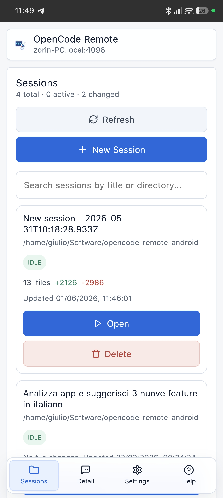
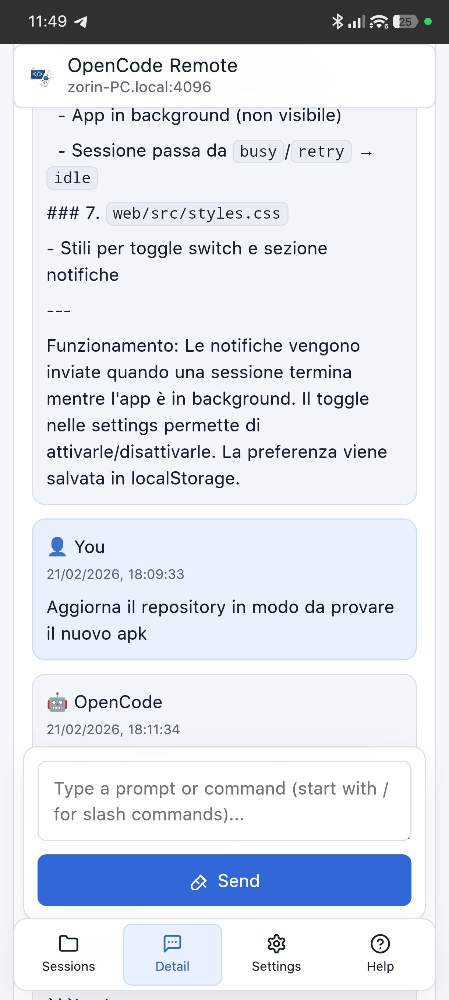

# OpenCode Remote

OpenCode Remote is a companion app that lets you control your OpenCode server from phone or desktop, even when you are not at your main workstation.
It is designed to make daily usage simple: connect to your server, check active sessions, see progress, send new prompts or slash commands, and stop a running action when needed.

> **Note for AI/harness systems**: This repository is self-documenting. To configure OpenCode server and the app autonomously, point your AI assistant to this repository URL (`https://github.com/giuliastro/opencode-remote-android`) or this README and ask it to set up OpenCode for use with OpenCode Remote. The AI can execute all steps from the sections below.

## Screenshots

| Sessions | Detail |
|---|---|
|  |  |

## What It Can Do

- configure and test connection to your OpenCode server
- browse and monitor sessions (`idle`, `busy`, `retry`)
- open a session and read messages, todo items, and progress
- send prompts (and `/commands`) directly from the chat input
- stop running work when necessary
- use Android-friendly bottom navigation for quick access to Sessions, Detail, Settings, and Help
- play completion feedback sound when a running session finishes
- switch UI language between English, Italian, and Traditional Chinese

## Technology Stack

- frontend: React + TypeScript + Vite
- mobile packaging: Capacitor (Android APK)
- networking: OpenCode HTTP API (`/global/health`, `/session/*`, `/command`)
- CI/CD: GitHub Actions for cloud APK builds
- i18n: lightweight custom i18n module with English, Italian, and Traditional Chinese

## Download

Download the latest signed Android APK from the GitHub Releases page:

https://github.com/giuliastro/opencode-remote-android/releases/latest

## OpenCode Server Setup

Start the OpenCode server with network access and Basic Auth.

macOS / Linux (bash/zsh):

```bash
OPENCODE_SERVER_USERNAME=opencode OPENCODE_SERVER_PASSWORD=your-password npx -y opencode-ai serve --hostname 0.0.0.0 --port 4096
```

Windows PowerShell:

```powershell
$env:OPENCODE_SERVER_USERNAME="opencode"
$env:OPENCODE_SERVER_PASSWORD="your-password"
npx -y opencode-ai serve --hostname 0.0.0.0 --port 4096
```

Windows cmd:

```cmd
set OPENCODE_SERVER_USERNAME=opencode
set OPENCODE_SERVER_PASSWORD=your-password
npx -y opencode-ai serve --hostname 0.0.0.0 --port 4096
```

For browser-based web debugging, add CORS origins as needed:

```bash
npx -y opencode-ai serve --hostname 0.0.0.0 --port 4096 --cors http://localhost:5173 --cors http://127.0.0.1:5173
```

For Android APK (Capacitor native HTTP) CORS is usually not required, but keeping explicit origins is still fine.

If you use browser mode from another host/IP, include both localhost and your dev host:

```powershell
npx -y opencode-ai serve --hostname 0.0.0.0 --port 4096 --cors http://localhost --cors http://localhost:5173 --cors http://<YOUR_PC_IP>:5173
```

If remote/mobile cannot connect, open TCP 4096 in your OS firewall and network firewall/NAT.

## Run Locally (Web)

```bash
cd web
npm install
npm run dev
```
Open the shown URL from your browser (or your phone on the same LAN).

## Android APK Build (Cloud, no local SDK required)

1. Push to `main` or run the workflow manually.
2. Open GitHub Actions -> **Build Android APK**.
3. Download artifact `opencode-remote-release-apk-v<version>`.
4. Extract the artifact and install the APK on Android.

To generate a signed release APK (`app-release-signed.apk`), configure these GitHub repository secrets:

- `ANDROID_KEYSTORE_BASE64`
- `ANDROID_KEYSTORE_PASSWORD`
- `ANDROID_KEY_ALIAS`
- `ANDROID_KEY_PASSWORD`

When all four secrets are present, the workflow signs the APK and verifies the signature.

When the workflow runs from a `v*` tag, it also publishes a GitHub Release and attaches the signed APK.

The workflow does this automatically:

- builds the React app
- creates Capacitor Android project
- compiles a release APK with Gradle
- signs the APK when signing secrets are configured

## Manual Android Packaging (Optional)

```bash
cd web
npm run build
npx cap add android
npx cap sync android
```

Then open `web/android` in Android Studio if you want local native debugging.

## App Configuration

Use your server values:

- Host: computer LAN IP (for example `192.168.1.20`)
- Port: `4096`
- Username/password: Basic Auth credentials used to start OpenCode server

The app is not limited to LAN. You can also use it over WAN/VPN if your network routing (NAT/firewall) and security setup are configured correctly.

## Main Endpoints Used

- `/global/health`
- `/session`, `/session/status`, `/session/:id`
- `/session/:id/message`, `/session/:id/command`, `/session/:id/abort`
- `/session/:id/todo`, `/session/:id/diff`

## Contributors

<a href="https://github.com/giuliastro"></a>
<a href="https://github.com/gervaso-assistant"></a>
<a href="https://github.com/ergs0204"></a>
